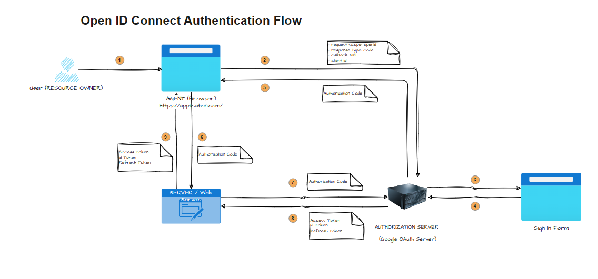

OAuth is all about Authorization. It's about allowing a 3rd party application to access resources from a RESOURCE SERVER on the user behalf. Like we saw in the previous example where the user (RESOURCE OWNER) is granting the Web Server (SERVER) to access user's Google contacts from the Google Contacts Server (RESOURCE SERVER).

Now the question is, can we use OAuth to authenticate the user to its own application against a 3rd party AUTHORIZATION SERVER like Google Auth Server or Facebook Auth Server. **_The answer is yes. It's using OpenID connect, an identity layer built on top of OAuth 2.0._**

OpenID Connect = OAuth + Identity, Authentication

- OpenID Authentication flow work is similar as OAuth Authorization code flow.

- In OAuth, you get access token which contains the application claims.

- In OpenID, you get access token as well as "id token". "id token" has users claims, which allows the client to verify the identity of the user. 

**Open ID Connect Flow**

1. Unauthenticated user browsers the application on the browser (AGENT)

2. AGENT redirects the user to the AUTHORIZATION SERVER and sends the following in the request:
   - request scope: openid
   - response type: code
   - callback URL
   - client id

3. AUTHORIZATION SERVER redirects the user to enter credentials and allow access.

4. AUTHORIZATION SERVER recieves the user credentials.

5. AUTHORIZATION SERVER redirects the user to callback URL and forwards the authorization code.

6. AGENT sends the authorization code to the App / Web SERVER.

7. SERVER sends the code to AUTHORIZATION SERVER.

8. AUTHORIZATION server validates the code, and returns the followings:
   - id token: it has the user profile
   - access token: it contains the access token to access the resource server.
   - refresh token: it is used to receive the access token again when it has expired.

9. SERVER authenticates the user and redirects to the application page. It also sends the tokens to the AGENT to store for subsequent calls.

