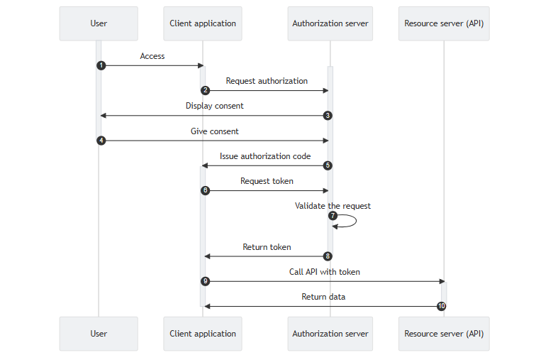
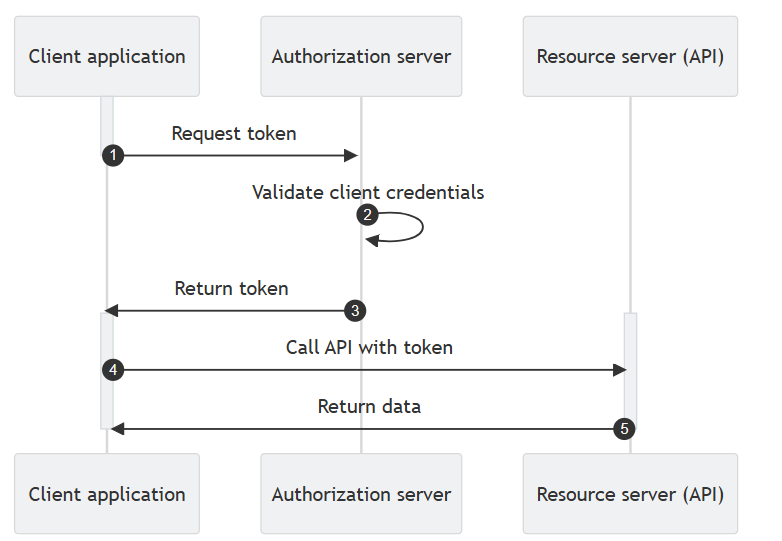
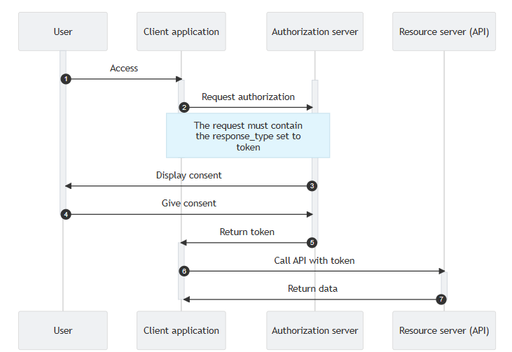
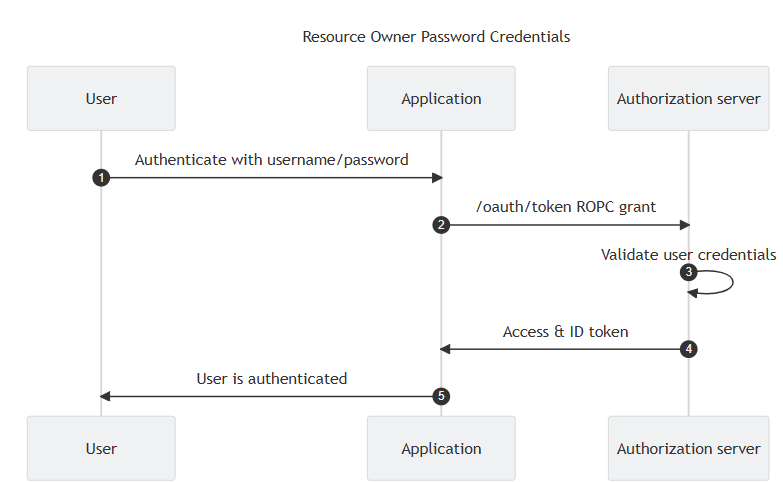

# Understanding OAuth 2.0: Types of Authorization Flows

OAuth 2.0 is an industry-standard protocol for authorization, allowing applications to obtain limited access to user accounts on an HTTP service. It simplifies the process of granting third-party applications access to a user’s resources without exposing credentials. There are several types of OAuth 2.0 authorization flows designed to cater to different use cases. This blog will explore these flows, explaining their use cases, strengths, and potential vulnerabilities.

## 1. Authorization Code Grant Flow

### Overview
According to the OAuth authorization code grant flow, an authorization server sends a temporary (authorization) code to a client. The code is exchanged for a token. This flow is available for confidential clients, for example, web applications with a backend that can store credentials securely. This way, the client can obtain one or more of the following token types:
- Access tokens
- Refresh tokens
- ID tokens



### Steps
1. A user tries to access the appliction (the client).

2. The client calls the authorization server's authorize endpoint.
```bash
curl --location \
--get \
--url "https://$TENANT_ID.$REGION_ID.authz.cloudentity.io/$TENANT_ID/$WORKSPACE_ID/oauth2/authorize" \
--data-urlencode "response_type=code" \
--data-urlencode "client_id=$CLIENT_ID"
```

3. The authorization server responds with the redirect URI. The user gets redirected to the login & content form (if any).

4. The user authenticates with his credentials and gives his consent.

5. The authorization server issues an authorization code.

6. The client application requests authentication to the token endpoint using the authentication method configured and the authorization code provided in the previous step.
    - The grant_type value in the API call must be authorization_code.
```bash
curl --request POST \
--url "https://$TENANT_ID.$REGION_ID.authz.cloudentity.io/$TENANT_ID/$WORKSPACE_ID/oauth/token" \
--data-raw "grant_type=authorization_code&code=$CODE&client_id=$CLIENT_ID&client_secret=$CLIENT_SECRET"
```

7. The authorization server validates the authorization code.

8. The authorization server returns the token.

9. The client application requests protected resources (API / Azure Resources) from the resource server and submits the token it received in the previous step.

10. The resource server validates the token and responds with the requested resources.

### Use Case
- You are developing an enterprise web application that needs to read user profiles and calendar events from Microsoft 365 using the Microsoft Graph API. To ensure secure access to the user's Microsoft 365 data, you implement the Authorization Code Grant Flow, allowing your web application to obtain an access token on behalf of the user.

- You are building a web application that allows users to manage their data stored in Azure Blob Storage. To ensure secure access to the user's Azure resources, you implement the Authorization Code Grant Flow, which provides a secure way for your web application to obtain an access token on behalf of the user.

### Security
- **High security**: Access tokens are exchanged server-to-server, reducing the risk of exposure.
- Access token issued to the end user is used to access resource. If the individual user does not have access, he can not access the resource.


## 2. Client Credentials Flow

### Overview
The client credentials grant type is used when there is no user present, and the client authenticates itself with the authorization server. In other words, the client credentials grant type is used by client applications to obtain an access token beyond the context of a user, for example, in machine-to-machine environments. 

Only confidential clients able to store their credentials securely can use the client credentials flow.



### Steps
1. The client requests an access token by calling the token endpoint of the Authorization Server.
```bash
curl -X POST https://$TENANT_ID.$REGION_ID.authz.cloudentity.io/$TENANT_ID/$WORKSPACE_ID/oauth2/token \
--header "Content-Type: application/x-www-form-urlencoded" \
--data-raw "grant_type=client_credentials&client_id=$CLIENT_ID&client_secret=$CLIENT_SECRET"
```
2. Authorization server validates the client credentials received in the request.

3. Authorization server returns the token.

4. The client requests protected resources from the resource server and submits the token it received in the previous step.

5. The resource server validates the token and responds with the requested resources.

### Use Case
- **Machine-to-machine communication**: You have a backend service, such as a microservice or a daemon, that needs to access secrets stored in Azure Key Vault. The backend service needs to authenticate itself with Azure AD and obtain an access token to securely access the Key Vault without user interaction. This can be achieved using the Client Credentials Flow.

### Security
- **High security**: No user involvement, and the credentials can be securely stored on the server.
- Uses the token issued to the Client Application. (no user token involved here)

## 3. Implicit Flow

### Overview
The Implicit Flow is designed for single-page applications (SPAs) and other public clients (pure JavaScript front-end applications) that cannot securely store a client secret. In this flow, the access token is directly returned in the URL fragment after user authorization. **No Authorization Code involved in the flow.**



### Steps
1. A user tries to access the application (the client).
2. The client sends an authorization request to the authorize endpoint. (The client must inform Cloudentity of its desired grant type by using the response_type parameter. For the implicit grant flow type, the value of the response_type parameter must be token.)
```bash
curl --location \
--get \
--url "https://$TENANT_ID.$REGION_ID.authz.cloudentity.io/$TENANT_ID/$WORKSPACE_ID/oauth2/authorize" \
--data-urlencode "response_type=token" \
--data-urlencode "client_id=$CLIENT_ID"
```
3. Cloudentity displays a consent screen for the user.

4. The user gives their consent.

5. Cloudentity returns the token embedded in the redirection URI.

6. The client requests protected resources from the resource server and presents the token it received in the previous step.

7. The resource server validates the token and responds with requested resources.

### Use Case
- **Single-page applications (SPAs)**: This flow is suitable when immediate access to the token is required, and there's no server-side component to handle the token exchange.

### Security
- **Moderate security**: The access token is exposed in the URL, making it susceptible to interception.

## 4. Resource Owner Password Credentials (ROPC) Flow

### Overview
In the ROPC Flow, the user provides their credentials (username and password) directly to the application, which then exchanges them for an access token. This flow is only recommended for highly trusted applications, such as first-party applications.



### Steps
1. The client requests token by calling the token endpoint.
```bash
# For client authentication method set to none:
curl --location --request POST \
--url "https://$TENANT_ID.$REGION_ID.authz.cloudentity.io/$TENANT_ID/$WORKSPACE_ID/oauth2/token" \
--header "Content-Type: application/x-www-form-urlencoded" \
--data-raw "grant_type=password&client_id=$CLIENT_ID&username=$USER_NAME&password=$USER_PASSWORD"

# For client authentication method set to client secret post or basic:
curl --location --request POST \
--url "https://$TENANT_ID.$REGION_ID.authz.cloudentity.io/$TENANT_ID/$WORKSPACE_ID/oauth2/token" \
--header "Content-Type: application/x-www-form-urlencoded" \
--data-raw "grant_type=password&client_id=$CLIENT_ID&client_secret=$CLIENT_SECRET&username=$USER_NAME&password=$USER_PASSWORD"

```
2. Authorization server validates user credentials.

3. Authorization server returns the access and ID tokens.

4. User gets authenticated.

### Use Case
- **Highly trusted applications**: Suitable when the application and the resource owner have a high level of trust, such as first-party applications.

### Security
- **Low security**: The application handles user credentials directly, increasing the risk of exposure and misuse.


## 6. Device Authorization Flow

### Overview
The Device Authorization Flow is tailored for devices with limited input capabilities, such as smart TVs or IoT devices. The device prompts the user to visit a URL on a secondary device and enter a code to authorize access.

### Steps
1. **User Code**: The device requests a user code and instructs the user to visit a URL.
2. **User Authorization**: The user authorizes access on a secondary device.
3. **Token Polling**: The device polls the authorization server to exchange the user code for an access token.

### Use Case
- **Devices with limited input capabilities**: Suitable for smart TVs, IoT devices, or other devices where user input is limited.

### Security
- **High security**: The user authorizes access on a secondary device, reducing the risk of interception.

## Conclusion

OAuth 2.0 provides a flexible and secure way to handle authorization for a variety of applications and use cases. Understanding the different flows and their appropriate use cases is crucial for implementing OAuth correctly and securely. Whether you are building a web application, a single-page application, a trusted backend service, or a device with limited input, OAuth 2.0 has a flow that fits your needs. Always consider the security implications of each flow and choose the one that best balances usability and security for your specific scenario.
