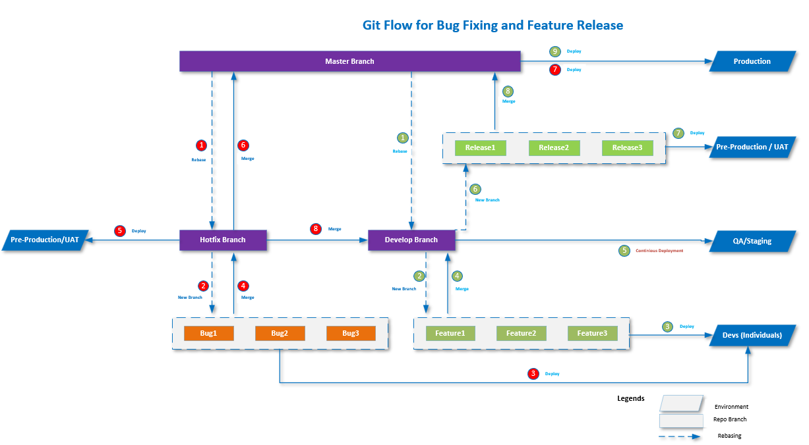

# Overview

A Git branching strategy is crucial for managing development, bug fixes, and deployment across various environments. The chosen strategy must suit business needs while enabling efficient feature development and bug resolution without causing conflicts between teams or delaying delivery.

In this blog, I’ll introduce a **3-branch strategy** that is adaptable to most business cases. It supports ongoing feature development and allows the support team to handle bug fixes independently, ensuring that production remains stable and reliable.

The three primary branches used in this strategy are:
1. **Master (or Main)**: The single source of truth for production.
2. **Hotfix**: Dedicated to bug fixes and urgent patches.
3. **Development**: The branch for new feature development.

By using these three branches, development and support work can progress without interruption, and changes can be integrated smoothly when ready for production deployment.

---

## Flow Diagram

The diagram below illustrates both the **bug fixing** and **feature development** processes. Each step is color-coded and numbered for clarity.



---

## Detailed Explanation of Flows

Below is a step-by-step explanation of how the feature development and bug-fixing workflows are carried out.

---

## Feature Development Flow

Feature development is carried out in the **Development** branch. To keep this branch synchronized with **Master**, rebasing must occur periodically. This ensures that the latest production code is always integrated into ongoing development work.

Here’s how feature development is managed:

### Steps:

**Step 1**: **Rebase Development with Master**  
- Regularly rebase the **Development** branch with the latest changes from **Master** whenever new code is merged into **Master**. This keeps the **Development** branch aligned with the production codebase and ensures that developers are working on the latest version of the application.

    ```bash
    git checkout development
    git fetch origin
    git rebase origin/master
    ```

**Step 2**: **Create a Feature Branch**  
- Each new feature must be developed in its own **feature branch**, which is created from the **Development** branch. This practice ensures that changes are isolated and do not affect the main development work until the feature is ready to be integrated.

    ```bash
    git checkout development
    git checkout -b feature/new-feature
    ```

**Step 3**: **Develop and Test Locally**  
- Developers work on their assigned feature in the **feature branch**. They conduct **unit tests** locally to ensure the new feature functions as expected before any further testing.

**Step 4**: **Merge Feature into Development**  
- After local testing is complete, the **feature branch** is merged back into the **Development** branch. This step integrates the feature with other in-progress work, allowing for integration testing in a shared environment.

    ```bash
    git checkout development
    git merge feature/new-feature
    ```

**Step 5**: **Deploy to QA for Testing**  
- After merging into **Development**, the branch is deployed to the **QA environment** for testing. QA focuses on verifying the functionality and identifying any issues related to integration between features.

**Step 6**: **Create a Release Branch**  
- After successful testing in **QA**, a **release branch** is created from **Development**. 
    ```bash
    git checkout development
    git checkout -b release/v1.0.0
    ```

**Step 7**: **Deploy to UAT for Testing**  

This release branch is then deployed to the **Pre-production/UAT environment** for User Acceptance Testing (UAT). Creating a release branch isolates the tested features, preparing them for the next production release.


**Step 8**: **Merge Release into Master**  
- Once UAT is complete, the release branch is merged into **Master**, signifying that the features are now ready for production. Merging into **Master** ensures that the production environment always reflects the latest, stable code.

    ```bash
    git checkout master
    git merge release/v1.0.0
    ```

**Step 8**: **Deploy Master to Pre-prod for Sanity Testing**  
- - After successful testing in **pre-production/UAT**, the code is deployed to **production**, making the new features live for users.


---

## Bug Fixing Flow

The **Hotfix** branch is used exclusively for bug fixes. It allows the support team to address urgent issues without disrupting feature development. The process of bug fixing follows a structured workflow to ensure rapid resolution while maintaining stability in production.

### Steps:

**Step 1**: **Rebase Hotfix with Master**  
- Before starting any bug fixes, rebase the **Hotfix** branch with the latest changes from **Master** to ensure it is aligned with the production code.

    ```bash
    git checkout hotfix
    git fetch origin
    git rebase origin/master
    ```

**Step 2**: **Create a Bugfix Branch**  
- For each bug, create a separate **bugfix branch** from **Hotfix**. This keeps each fix isolated, making it easier to manage and test.

    ```bash
    git checkout hotfix
    git checkout -b bugfix/issue-description
    ```

**Step 3**: **Fix the Bug and Test Locally**  
- Apply the necessary code changes to fix the bug. Run local tests to verify that the bug is resolved and that the fix doesn’t break other parts of the code.

**Step 4**: **Merge Bugfix Branch into Hotfix**  
- Once the bug fix is confirmed, merge the **bugfix branch** back into **Hotfix**. At this point, the bug fix is ready for more extensive testing.

    ```bash
    git checkout hotfix
    git merge bugfix/issue-description
    ```

**Step 5**: **Deploy Hotfix to Pre-production/UAT for Testing**  
- After merging the bug fix into **Hotfix**, deploy it to the **pre-production/UAT**  for thorough testing. This ensures the fix resolves the issue without introducing new bugs.

**Step 6**: **Merge Hotfix into Master**  
- Once testing is complete, the **Hotfix** branch is merged into **Master**, preparing the code for production deployment.

    ```bash
    git checkout master
    git merge hotfix
    ```

**Step 7**: **Production Deployment**  
- After merging into **Master**, the bug fix is deployed to the **production environment**, resolving the issue for end users.

**Step 8**: **Merge Hotfix into Development**  
- To ensure that future development includes the bug fixes, the **Hotfix** branch is also merged into the **Development** branch.

    ```bash
    git checkout development
    git merge hotfix
    ```

---

## Practical Issues the Strategy Addresses

This branching strategy solves several common issues encountered in software development and deployment processes:

1. **Parallel Development and Bug Fixing**:  
   By separating feature development and bug fixing into **Development** and **Hotfix** branches, this strategy allows teams to work on both simultaneously without interfering with each other. Bug fixes can be released quickly without waiting for ongoing feature work to be completed.

2. **Isolated Testing Environments**:  
   The use of distinct branches for **Development**, **QA**, **pre-prod**, and **production** ensures that code is tested thoroughly in isolated environments before it reaches production. This reduces the risk of introducing bugs into live environments.

3. **Controlled Releases**:  
   The introduction of **release branches** allows for controlled releases to production. Features can be packaged and tested together in **QA** and **UAT**, allowing business stakeholders to perform final acceptance testing before a production release.

4. **Minimized Merge Conflicts**:  
   By periodically rebasing **Development** and **Hotfix** branches from **Master**, this strategy ensures that the latest production code is always part of ongoing development and bug fixes, minimizing the potential for merge conflicts later on.

5. **Quick Resolution of Critical Issues**:  
   The dedicated **Hotfix** branch enables quick responses to critical production issues. Developers can fix and test urgent bugs without disturbing the feature development pipeline, ensuring business continuity and reliability.

6. **Consistent Codebase for Future Features**:  
   Merging the **Hotfix** branch back into **Development** ensures that future features are built on top of a codebase that includes all critical bug fixes, avoiding regressions in subsequent releases.

---

## Conclusion

The **3-branch Git strategy** effectively balances the need for ongoing feature development and fast bug resolution while maintaining the stability of production environments. By following the outlined processes, teams can work efficiently, deliver new features on time, and ensure a stable and reliable production codebase. This approach provides a clear and structured workflow that aligns with business requirements and ensures smooth development and deployment cycles.
