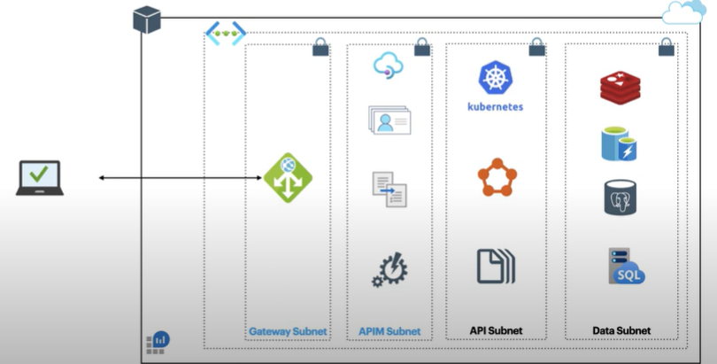
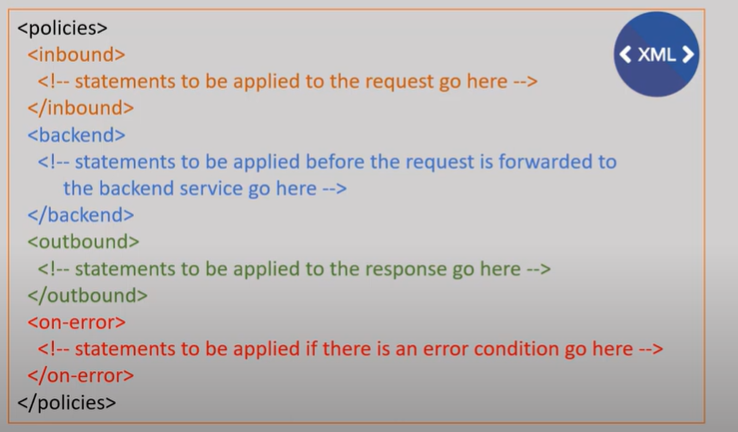

# API Management Production Setup and Subnets

## APIM Policies
Policies define how the API shall behave. It can be defined at global level, product level, api level, and operation level.

## What you can do with API Management?
- You can define an abstract layer on top APIs to control access to it.
- You define policies to change the API behaviour
- You can have publish-subscription here, a subscriber must subscribe to a service before it uses.
- You can group policies to Product and control its access as a whole.
- Subscriber can use Developer portal to request subscription to API or product.

## APIM Network Options
- Without any vNet (Both inbound and outbound traffic travels on public internet)
- With vNet External Mode (inbound public, outbound on vnet)
- With vNet Internal Mode (both inboud and outbound on vnet)
- With Private Link (Make it accessible as private link service which can be accessed from other subscription, tenant, and AFD.)

