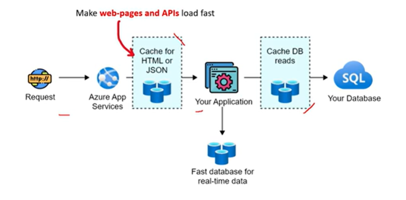

# Use of Redis Cache
- Storing web server session
- Storing cached HTML or JSON to speed up response times for rendering web pages or API calls.
- User in-front of a database to reduce read contention on the database (its called Aside-Cache Pattern)

